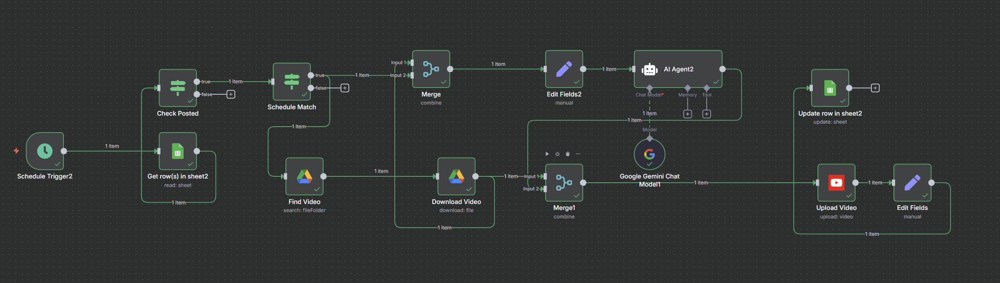

# 🚀 AI YouTube Shorts Automation with n8n, Gemini AI, Google Drive & YouTube API

<p align="center">
  
</p>

<p align="center">
  
  
  
  
  
  
</p>

<p align="center">
  <b>AI-Powered YouTube Shorts Publishing Pipeline using n8n, Gemini AI, Google Drive, Google Sheets, Docker, and YouTube Data API</b>
</p>

---

## 📖 Overview

This project is a fully automated AI-powered content publishing workflow built using **n8n** and deployed locally using **Docker**.

The automation continuously monitors scheduled content from **Google Sheets**, fetches videos from **Google Drive**, generates AI-powered captions and hashtags using **Google Gemini AI**, uploads videos directly to **YouTube Shorts**, updates publishing status, and archives processed files automatically.

The entire workflow operates without manual intervention, making it ideal for creators, agencies, and teams managing high-volume content publishing.

---

## ✨ Features

✅ Automated YouTube Shorts Upload

✅ AI Generated Captions

✅ AI Generated Hashtags

✅ Google Sheets Content Calendar

✅ Google Drive Integration

✅ YouTube Data API Integration

✅ Automated Status Tracking

✅ Automatic File Archiving

✅ OAuth 2.0 Authentication

✅ Docker-Based Local Deployment

✅ No-Code / Low-Code Automation

✅ Scalable Publishing Workflow

✅ Production-Ready Architecture

---

## 🎯 Problem Solved

Uploading YouTube Shorts manually involves:

- Managing content schedules
- Writing captions
- Generating hashtags
- Uploading videos
- Tracking published content
- Organizing uploaded files

This workflow automates the complete process from scheduling to publishing.

---

## 🏗 Workflow Architecture

```text
Schedule Trigger
        │
        ▼
Google Sheets
(Read Scheduled Content)
        │
        ▼
Check Status
(Not Uploaded)
        │
        ▼
Schedule Validation
        │
        ▼
Google Drive Search
        │
        ▼
Download Video
        │
        ▼
Gemini AI
(Caption + Hashtags)
        │
        ▼
YouTube Upload
        │
        ▼
Update Google Sheet
        │
        ▼
Move Uploaded File
```

---

## ⚙ Workflow Execution

### 1. Schedule Trigger

The workflow starts automatically at predefined times.

### 2. Read Content Calendar

Scheduled videos are fetched from Google Sheets.

### 3. Validate Upload Status

Checks whether the video is already uploaded.

### 4. Match Scheduled Time

Verifies if the current time matches the scheduled publishing time.

### 5. Search Video

Searches the video file inside Google Drive.

### 6. Download Video

Downloads the video from Google Drive.

### 7. AI Content Generation

Google Gemini AI generates:

- Caption
- Hashtags

based on the provided content outline.

### 8. Upload to YouTube Shorts

Video is uploaded automatically using the YouTube Data API.

### 9. Update Publishing Status

Google Sheets is updated with upload status.

### 10. Archive Uploaded File

Uploaded videos are automatically moved to an archive folder.

---

## 🛠 Tech Stack

| Technology | Purpose |
|------------|----------|
| n8n | Workflow Automation |
| Docker | Local Deployment |
| Google Sheets API | Scheduling |
| Google Drive API | File Storage |
| YouTube Data API v3 | Video Upload |
| Google Gemini AI | Caption Generation |
| OAuth 2.0 | Authentication |
| Google Cloud Platform | API Management |

---

## 📂 Repository Structure

```text
ai-youtube-shorts-automation-n8n-gemini-google-drive
│
├── README.md
├── workflow.png
├── Drive to youtube upload automation.json
```

---

## 📸 Workflow Screenshot

The complete workflow architecture:


---

# 🔐 Required Credentials

This workflow requires four credentials.

---

## Google Drive OAuth2

Used For:

- Searching videos
- Downloading videos
- Moving uploaded videos

Required Scope:

```text
https://www.googleapis.com/auth/drive
```

---

## Google Sheets OAuth2

Used For:

- Reading content schedules
- Updating upload status

Required Scope:

```text
https://www.googleapis.com/auth/spreadsheets
```

---

## YouTube OAuth2

Used For:

- Uploading YouTube Shorts

Required Scopes:

```text
https://www.googleapis.com/auth/youtube
https://www.googleapis.com/auth/youtube.upload
```

---

## Google Gemini API

Used For:

- Caption generation
- Hashtag generation

Get API Key:

https://aistudio.google.com/

---

# ☁️ Google Cloud Setup

## Step 1: Create Project

Visit:

https://console.cloud.google.com/

Create a new project.

---

## Step 2: Enable APIs

Enable the following APIs:

- Google Drive API
- Google Sheets API
- YouTube Data API v3

---

## Step 3: Configure OAuth Consent Screen

1. Open OAuth Consent Screen
2. Select External
3. Enter application details
4. Add yourself as a Test User

---

## Step 4: Create OAuth Credentials

Create:

```text
OAuth Client ID
```

Application Type:

```text
Web Application
```

Authorized Redirect URI:

```text
http://localhost:5678/rest/oauth2-credential/callback
```

---

# 🐳 Running n8n Locally Using Docker

This workflow was developed and tested on a local Docker-based n8n environment.

## Pull n8n Image

```bash
docker pull n8nio/n8n
```

## Run n8n Container

```bash
docker run -it --rm \
-p 5678:5678 \
-v ~/.n8n:/home/node/.n8n \
n8nio/n8n
```

## Open n8n

```text
http://localhost:5678
```

---

# 📊 Google Sheet Format

Create a Google Sheet with the following structure:

| File Name | Outline | Schedule Time | Status |
|------------|----------|---------------|---------|
| video1.mp4 | AI News | 2026-06-01 09:00 | Pending |
| video2.mp4 | Motivation | 2026-06-01 18:00 | Pending |

---

# 📁 Google Drive Folder Structure

```text
Google Drive
│
├── Scheduled Videos
│   ├── video1.mp4
│   ├── video2.mp4
│
└── Uploaded Videos
    ├── video1.mp4
    ├── video2.mp4
```

---

# 📥 Installation

## Clone Repository

```bash
git clone https://github.com/YOUR_USERNAME/ai-youtube-shorts-automation-n8n-gemini-google-drive.git
```

---

## Import Workflow

Import:

```text
Drive to youtube upload automation.json
```

into n8n.

---

## Configure Credentials

Create the following credentials:

- Google Drive OAuth2
- Google Sheets OAuth2
- YouTube OAuth2
- Google Gemini API

---

## Update IDs

Replace:

- Google Sheet ID
- Source Folder ID
- Archive Folder ID

with your own values.

---

## Activate Workflow

Set workflow status to:

```text
Active
```

The automation will start running automatically.

---

# 💼 Resume Highlights

This project demonstrates:

- Workflow Automation
- AI Integration
- API Integration
- OAuth Authentication
- Google Cloud Services
- Docker Deployment
- Content Automation
- Low-Code Development
- Production Workflow Design

---

# 🚀 Future Improvements

- Instagram Reels Upload
- Facebook Reels Upload
- TikTok Upload
- LinkedIn Video Publishing
- AI Thumbnail Generation
- AI Title Generation
- Telegram Notifications
- Slack Notifications
- Analytics Dashboard
- Multi-Language Captions
- Multi-Platform Publishing

---

# 📈 Use Cases

### Content Creators

Automate YouTube Shorts publishing.

### Faceless YouTube Channels

Publish content automatically without manual uploads.

### Marketing Agencies

Manage large-scale content publishing.

### Social Media Teams

Automate repetitive publishing workflows.

### AI Content Businesses

Scale content operations efficiently.

---

# 🔍 SEO Keywords

AI Automation, YouTube Shorts Automation, n8n Workflow, Google Gemini AI, YouTube API, Google Drive Automation, Google Sheets Automation, Docker Automation, Content Automation, Social Media Automation, AI Content Pipeline, Creator Tools, No-Code Automation, Low-Code Workflow, Automated Video Publishing.

---

# 👨‍💻 Author

## Abdul Shamshuddin Sheikh

B.Tech Computer Science (Artificial Intelligence)

Vishwakarma Institute of Technology (VIT), Pune

- GitHub: https://github.com/AbdulSheikh9906
- LinkedIn: Add Your LinkedIn Profile

---

# ⭐ Support

If you found this project useful:

⭐ Star the repository

🍴 Fork the repository

📢 Share it with fellow developers and creators

---

# 📜 License

This project is licensed under the MIT License.

Feel free to use, modify, and distribute this project.

---

## 🔥 GitHub Topics

```text
n8n
youtube-shorts
youtube-automation
youtube-api
gemini-ai
google-gemini
google-drive
google-sheets
workflow-automation
content-automation
social-media-automation
ai-automation
artificial-intelligence
docker
nocode
lowcode
automation
creator-tools
youtube-content
```
